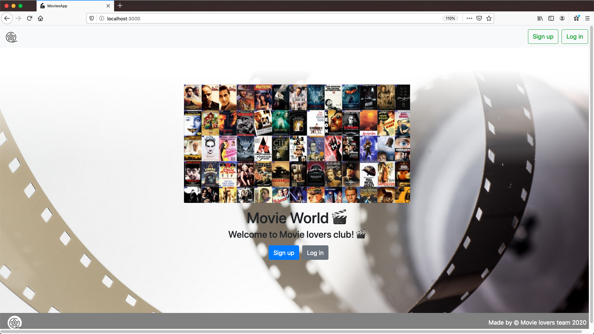
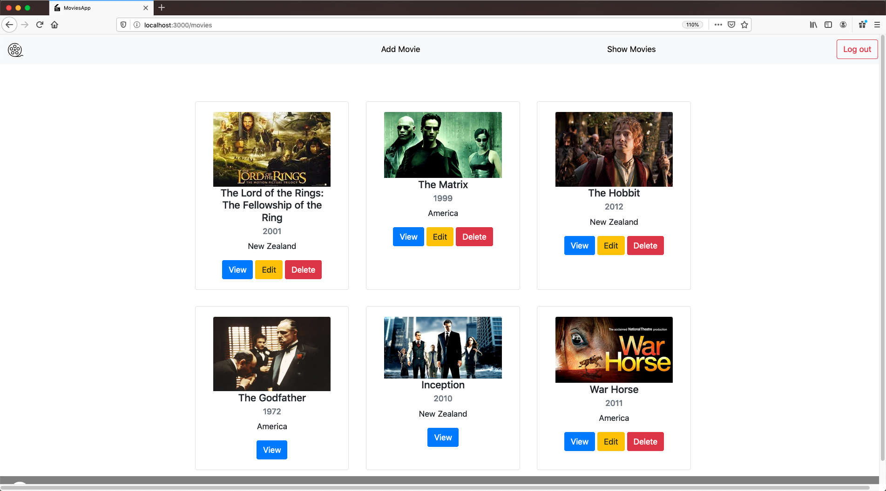
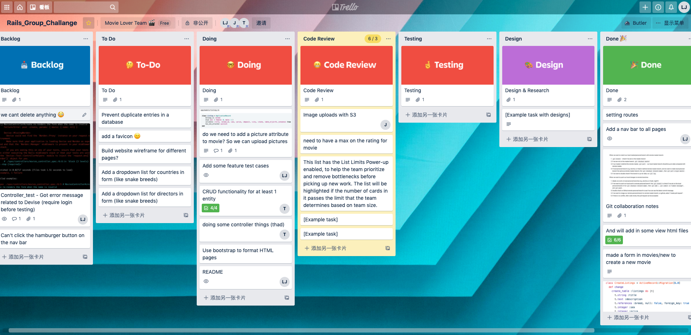
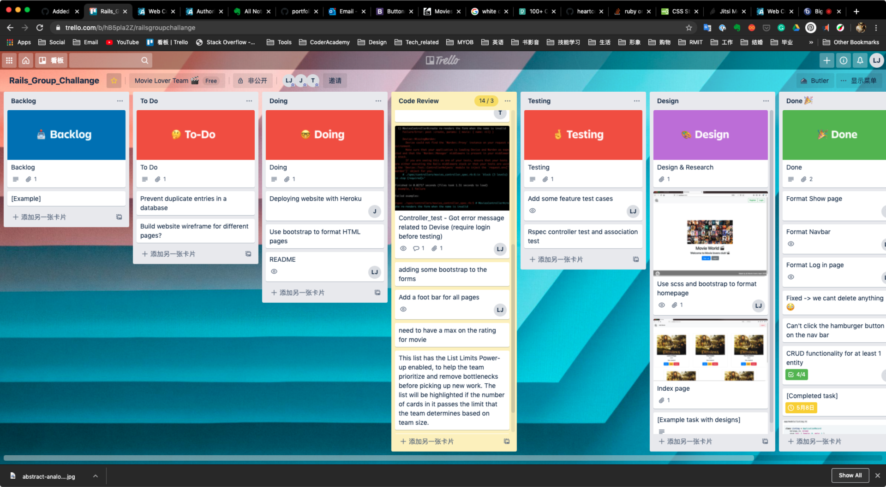

# Movie App

### A link (URL) to the website:
 https://movies-app-teamwork.herokuapp.com/

### A link to the GitHub repository:
https://github.com/jishan33/movies-app

# Setup

1. Clone this repository
2. Change into the project directory
3. Configuration: run `yarn install`
4. Database creation: run `rails db:create`
5. Database initialization: run `rails db:setup`
6. open `localhost:3000` in your web browser
7. How to run the test suite: `bin/rspec`

* Ruby version

  ruby 2.7.0p0 (2019-12-25 revision 647ee6f091) [x86_64-darwin18]

* System dependencies

# Purpose

The website is designed for movie lovers to create,read, update and delete movie entries (including attributes like name, release year, rating, length, director, country and casts).

# Functionality and Features

### Component 1: Successful CRUD functions

### Component 2: AWS S3 Active Storage function in production environment

### Componenet 3: Navbar and Footbar on all pages

# Screenshots

# Target audience

The target audience for the website are:
  1. Movie lovers
  2. Filmmakers

# Tech stack
- Ruby on Rails
- Bootstrap
- Heroku
- AWS S3
- rspec

# Project Management

#### 07/05/2020

#### 08/05/2020

